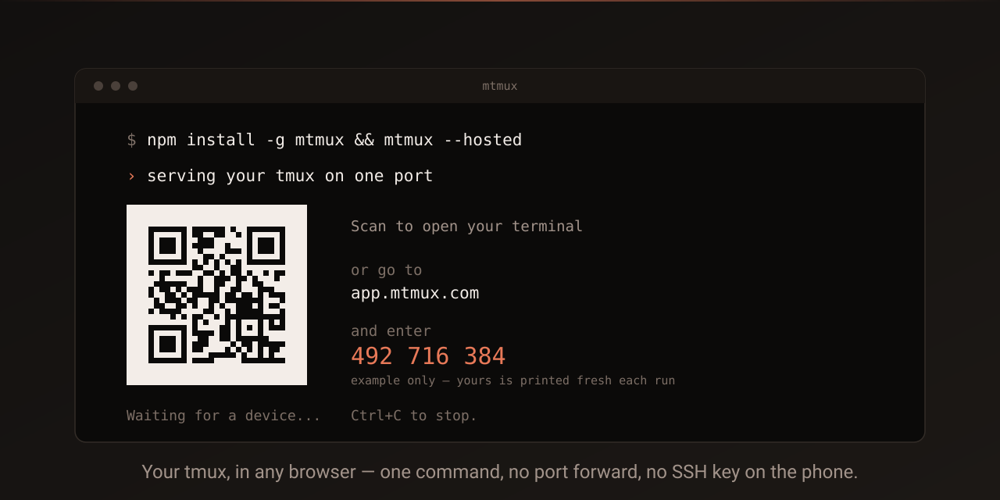
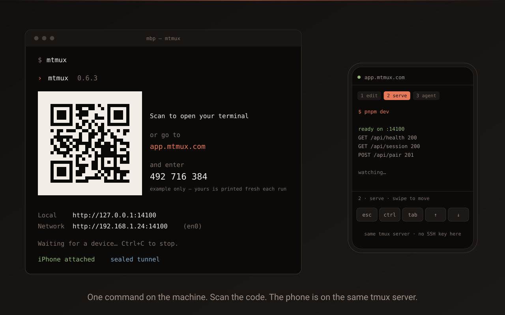

<div align="center">



# mtmux — your tmux, in any browser

**A self-hosted browser terminal for [tmux](https://github.com/tmux/tmux).** Run one
command on the machine that has your sessions, scan the code it prints, and your
phone, tablet or laptop is on that terminal — from your own wifi or from cellular
in another country. No port forwarding, no account, no SSH key on the phone.

```bash
npm install -g mtmux && mtmux
```

[](https://www.npmjs.com/package/mtmux)
[](https://github.com/mtmux/mtmux/actions)
[](LICENSE)
[](https://github.com/mtmux/mtmux/pkgs/container/mtmux-api)

[Docs](https://docs.mtmux.com/docs) · [npm](https://www.npmjs.com/package/mtmux) · [Self-hosting](https://docs.mtmux.com/docs/self-hosting) · [Security](SECURITY.md)

</div>

---

## Install

```bash
npm install -g mtmux
mtmux
```

That's it. `start` is the default command. mtmux generates a token, serves your
tmux on one port, opens a sealed tunnel, prints a scannable nine-digit code, and
opens your browser. No config file, no Docker, no reverse proxy, no port forward.

Requires **Node 22+** and **tmux** on your PATH.

<details>
<summary>Other package managers &amp; Docker</summary>

```bash
bun install -g mtmux
pnpm add -g mtmux

# Or run the whole thing — your own broker included — on your own box:
git clone https://github.com/mtmux/mtmux.git && cd mtmux
cp .env.example .env && docker compose up
```

</details>

## Demo



**Scan it, then say yes.** One command, no second terminal. The machine asks
before it lets anything in — answer in the terminal, in `mtmux approve`, or in
the app on a phone already connected — and it asks every time a device
connects, not once when it pairs. If the camera won't
cooperate, type the nine digits at `app.mtmux.com`. It works the same on your own
network and over cellular — mtmux takes the direct path when the device can reach
your machine and falls back to a relayed tunnel when it can't. You don't choose,
and the switchover is invisible.

`--no-qr` drops the block and keeps the digits, which is what you want in a
terminal that mangles block characters, or when you are reading this over SSH:

```
$ mtmux --no-qr
  ›  mtmux  0.6.3

  Open your terminal

  Go to     app.mtmux.com
  and enter 492 716 384

  Local    http://127.0.0.1:14100
  Network  http://192.168.1.24:14100  (en0)

  Waiting for a device…   Ctrl+C to stop.
```

## The threat model, in three lines

1. **The last six digits never reach our servers.** They're the password for a
   [CPace](https://datatracker.ietf.org/doc/draft-irtf-cfrg-cpace/) PAKE — not sent,
   not hashed, not derivable. Only the leading three, which route the mailbox.
2. **On the relayed path the broker forwards ciphertext it cannot read.** Frames are
   AES-256-GCM under a per-connection subkey the broker never holds. It logs counts
   and outcomes — never a code, a mailbox id, or an IP-to-mailbox mapping.
3. **One wrong guess burns the code.** A failed key confirmation destroys the
   mailbox, and the claim budget is charged when a socket attaches, not when a
   request arrives — so guessing is bounded online and impossible offline.

And one more, because it is the one people are surprised by: **a valid token is
not permission.** Approval is asked per _connection_ — loopback, LAN and
tunnelled alike — not once per credential. A credential is a file on somebody
else's computer, and that it paired last month is a fact about the past. One
answer covers a device while it stays connected and for two minutes after, so
tabs and a reconnect on a train do not each ring the bell; a machine with no
terminal attached trusts what it already knows, because refusing everything for
want of anyone to ask is not safer, it is broken.

On the **direct** path the two devices talk over your own network and we are simply
not in it; there the browser's own TLS, or on a plain LAN nothing, is what protects
the hop. We say so rather than calling the whole product "end-to-end encrypted".

[How pairing works →](https://docs.mtmux.com/docs/pairing) ·
[The sealed tunnel →](https://docs.mtmux.com/docs/sealed-tunnel) ·
[Security →](https://docs.mtmux.com/docs/security)

## Self-hosting first

mtmux is self-hosted by default and there are three degrees of independence:

| You want                            | Command             | Talks to our servers                            |
| ----------------------------------- | ------------------- | ----------------------------------------------- |
| Your machine, your tmux, your token | `mtmux`             | Only the pairing broker, and only in ciphertext |
| Nothing leaves the building         | `mtmux start`       | **Never** — this is the default                 |
| Your own broker and web client too  | `docker compose up` | **Never**                                       |

```bash
mtmux config set api https://api.example.com   # point every command at your broker
```

`mtmux start` with no route to `api.mtmux.com` degrades to LAN serving rather than
failing, by design. Accounts are optional forever — anonymous pairing is the
default mode, not a degraded one. [Self-hosting →](https://docs.mtmux.com/docs/self-hosting)

## Features

- **True terminal fidelity** — xterm.js + WebGL, Unicode 11, 256-color
- **Mobile-first** — keyboard toolbar, swipe gestures, haptic feedback
- **Files + previews** — Monaco editor, syntax highlighting, image preview
- **Session recording** — asciinema v2 `.cast` capture and scoped sharing
- **Nine-digit pairing** — a phone on from anywhere, with a secret our servers never see
- **Single port** — HTTP and WebSocket share one upstream behind nginx or Caddy
- **PWA** — installable on iOS and Android home screens
- **Great with coding agents** — Claude Code, Codex CLI, and long unattended runs

## Why mtmux?

|                                  | mtmux | ttyd / GoTTY | Web SSH | tmate    |
| -------------------------------- | ----- | ------------ | ------- | -------- |
| Mobile-first UX                  | ✓     | —            | —       | —        |
| File browser + Monaco editor     | ✓     | —            | —       | —        |
| Single-port (HTTP + WS)          | ✓     | ✓            | ✓       | —        |
| Self-hosted                      | ✓     | ✓            | ✓       | optional |
| Reaches a device off your LAN    | ✓     | —            | —       | ✓        |
| WebGL terminal                   | ✓     | —            | —       | —        |
| Built for coding-agent workflows | ✓     | —            | —       | —        |

## Quick start

```bash
mtmux                          # serve, print a code, open a browser
mtmux start --hosted           # + a tunnel and a code for app.mtmux.com
mtmux config set reach hosted  # make that the default on this machine
mtmux start --local            # LAN and loopback only, whatever reach says
mtmux start --port 8080        # different port
mtmux start --open             # also open a browser here
mtmux pair 492716384           # join a pairing the browser started
mtmux status                   # what's running here
mtmux stop                     # stop it
mtmux doctor                   # why isn't this working?
mtmux devices                  # browsers this machine trusts
mtmux devices remove <id>      # forget one; it needs a new code to come back
mtmux record <session>         # capture a session to an asciinema cast
mtmux token rotate             # new token; paired devices are kept
mtmux --help
```

[Full CLI reference →](https://docs.mtmux.com/docs/cli)

## Behind a reverse proxy

Usually unnecessary — pairing already gets a remote device on without exposing a
port. But if you want your own domain in front of it:

The CLI is **single-port**: HTTP and the WebSocket (served same-origin at
`/_relay`) share one upstream, so you proxy everything to one port. Do **not**
set `NEXT_PUBLIC_RELAY_URL` and do **not** add a separate `/ws` location in CLI
mode — that's only for the split web+relay deployment (see
[Production deployments](#production-deployments)).

Nginx:

```nginx
location / {
  proxy_pass http://127.0.0.1:14100;
  proxy_http_version 1.1;
  proxy_set_header Upgrade $http_upgrade;
  proxy_set_header Connection "upgrade";
  proxy_set_header Host $host;
  proxy_read_timeout 3600s;
}
```

Caddy:

```caddy
mtmux.example.com {
  reverse_proxy 127.0.0.1:14100
}
```

## Configuration

| Flag                      | Default                              | Description                                           |
| ------------------------- | ------------------------------------ | ----------------------------------------------------- |
| `-p, --port <n>`          | `14100`                              | HTTP + WS port                                        |
| `-h, --host <addr>`       | `0.0.0.0` on a LAN, else `127.0.0.1` | Bind address. An explicit value always wins.          |
| `--local`                 | on unless `reach` says otherwise     | LAN and loopback only — never contact a broker        |
| `--hosted`                | off                                  | Also open a tunnel and print a code for app.mtmux.com |
| `--api <url>`             | `https://api.mtmux.com`              | Pairing broker, for this command only                 |
| `-n, --name <label>`      | hostname                             | What to call this machine in the dashboard            |
| `--no-qr`                 | QR shown                             | Print the code without the QR block                   |
| `-t, --token <value>`     | auto                                 | Override the auth token for this run                  |
| `--allowed-paths <paths>` | `$HOME`                              | Comma-separated path allow-list for the file browser  |
| `--open`                  | off                                  | Also open a browser on this machine                   |
| `--json`                  | off                                  | Machine-readable startup record                       |

There is deliberately **no fixed default host**: mtmux binds `0.0.0.0` when the machine has a usable private address on a real interface (container bridges and VPN overlays don't count) and `127.0.0.1` when it doesn't. You do not need `--host 0.0.0.0` to reach it from your phone.

| Env                   | Default                 | Description                                                 |
| --------------------- | ----------------------- | ----------------------------------------------------------- |
| `MTMUX_CONFIG_DIR`    | `~/.mtmux`              | Where `config.json` and `server.json` live                  |
| `MTMUX_API_URL`       | `https://api.mtmux.com` | Pairing broker for this process. Point it at your own.      |
| `MTMUX_APP_URL`       | `https://app.mtmux.com` | The web client the QR and pairing link point at             |
| `MTMUX_BUILD_API_URL` | —                       | Build time only — bakes a broker origin into the web bundle |

Stored settings beat neither: precedence is `--api` → `MTMUX_API_URL` →
`mtmux config set api` → the default. The auto-generated token lives at
`~/.mtmux/config.json` (mode `0600`), alongside the device key and the list of
paired browsers.

## Architecture

On your own network, one Node process and one HTTP server:

```
Browser  ⇄ http/ws ⇄  mtmux node  ⇄ pty ⇄  tmux
           (one port)  Next.js + ws         your sessions
```

For a device that can't reach your machine, a blind broker relays sealed frames:

```
Browser ──┬─ raced first ─────── direct ──────────────┬── mtmux ⇄ tmux
          └─ api.mtmux.com ── AES-256-GCM ciphertext ─┘
             (holds no key, sees no keystroke)
```

[Architecture →](https://docs.mtmux.com/docs/architecture) · [The sealed tunnel →](https://docs.mtmux.com/docs/sealed-tunnel)

## FAQ

<details>
<summary><strong>Do I need an account?</strong></summary>

No, and you never will. Anonymous pairing is the default path and is a permanent
invariant of the project. An account buys a dashboard and hosted extras; it buys
nothing that pairing needs.

</details>

<details>
<summary><strong>Do I have to open a port or set up a VPN?</strong></summary>

No. That's the point of the nine-digit code: the two devices find each other
through a broker that can't read what they say to one another. If the device _can_
reach your machine directly, mtmux uses that path instead — it races both.

</details>

<details>
<summary><strong>Can your servers see my terminal?</strong></summary>

Not on the relayed path — the broker forwards AES-256-GCM frames under a key it
doesn't have, and logs counts and outcomes only. The honest caveat is that on the
hosted path the browser's CPace and AES-GCM code is served by the same party that
runs the broker. Self-hosting the web client is the real answer to that, and it's
one `docker compose up`.

</details>

<details>
<summary><strong>Is nine digits really enough?</strong></summary>

Three of them route a mailbox and six are the PAKE password. A code buys exactly
one _online_ guess — a wrong key confirmation destroys the mailbox — and the
budget is charged when a socket attaches, so a request flood buys nothing. There
is no offline attack because the secret is never transmitted in any form.

</details>

<details>
<summary><strong>Does restarting mtmux un-pair my phone?</strong></summary>

No. Pairing-derived tokens are replayed on boot, so a device stays trusted until it
goes 90 days unseen or you run `mtmux devices remove <id>` (`revoke` still works).
Removing closes any socket that device is holding, and it will be asked about
again next time it connects regardless.

</details>

<details>
<summary><strong>Can I run it entirely on my own infrastructure?</strong></summary>

Yes — CLI, web client and pairing broker. `git clone`, `cp .env.example .env`,
`docker compose up`, then `mtmux config set api https://api.example.com`. It comes
up working with `DATABASE_URL` unset: no accounts, no billing, no secrets to
manage. See [Self-hosting](https://docs.mtmux.com/docs/self-hosting).

</details>

<details>
<summary><strong>Does it work with Claude Code and other coding agents?</strong></summary>

That is a large part of why it exists — a long unattended run you can check on
from a phone, approve from a phone, and steer from a phone. See
[Coding agents](https://docs.mtmux.com/docs/agents).

</details>

## Development

```bash
pnpm install
pnpm dev          # web + relay on ONE port (14100), same as `mtmux start`
pnpm build
pnpm test
pnpm typecheck
pnpm lint
```

`pnpm dev` runs the shipped single-port topology — Next.js (Turbopack, with
HMR) and the relay in one process, relay WebSocket at `/_relay` — so single-port
bugs surface while you work rather than at release. It prints a login URL with
the dev token (`dev-token`) baked in. Override the port with `PORT=…`.

Two escape hatches:

```bash
pnpm dev:split    # the split model: web 14100 + relay 14300 (Docker/PM2 shape)
pnpm dev:pairing  # the hosted-pairing topology, broker included
pnpm dev:docs     # docs site on 14102
```

The repo is a pnpm + Turborepo monorepo. See [CLAUDE.md](CLAUDE.md) for the full layout.

## Production deployments

The CLI (`mtmux start`) is the primary path for self-hosting on a single
machine: one process, one port, WebSocket at `/_relay`. For multi-tenant or
container deployments, the repo also ships a **split web+relay** model with
separate ports (web `14100`, relay `14300`), configured via
`NEXT_PUBLIC_RELAY_URL` and a `/ws` reverse-proxy route:

- **Docker compose** (`docker-compose.yml`) — broker + web, the supported self-host path
- **Docker compose** (`docker-compose.prod.yml`) — separate web/relay services
- **PM2** (`ecosystem.config.cjs`) — the five-app topology the hosted service runs

See [Deployment](https://docs.mtmux.com/docs/deployment) for the split-model details, and [Self-hosting](https://docs.mtmux.com/docs/self-hosting) for running your own pairing broker.

## Documentation

[docs.mtmux.com](https://docs.mtmux.com/docs) — or `apps/docs/content/docs/` in this repo.

- [Getting started](https://docs.mtmux.com/docs/getting-started)
- [CLI reference](https://docs.mtmux.com/docs/cli)
- [How pairing works](https://docs.mtmux.com/docs/pairing)
- [The sealed tunnel](https://docs.mtmux.com/docs/sealed-tunnel)
- [Security](https://docs.mtmux.com/docs/security)
- [Self-hosting](https://docs.mtmux.com/docs/self-hosting)

## Contributing

PRs welcome. Conventional commits with an [enforced scope list](commitlint.config.js). See [CONTRIBUTING.md](CONTRIBUTING.md) and [CODE_OF_CONDUCT.md](CODE_OF_CONDUCT.md).

Security reports: [SECURITY.md](SECURITY.md) — please don't open a public issue.

## License

MIT © Gagandeep Singh
